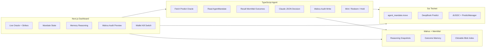
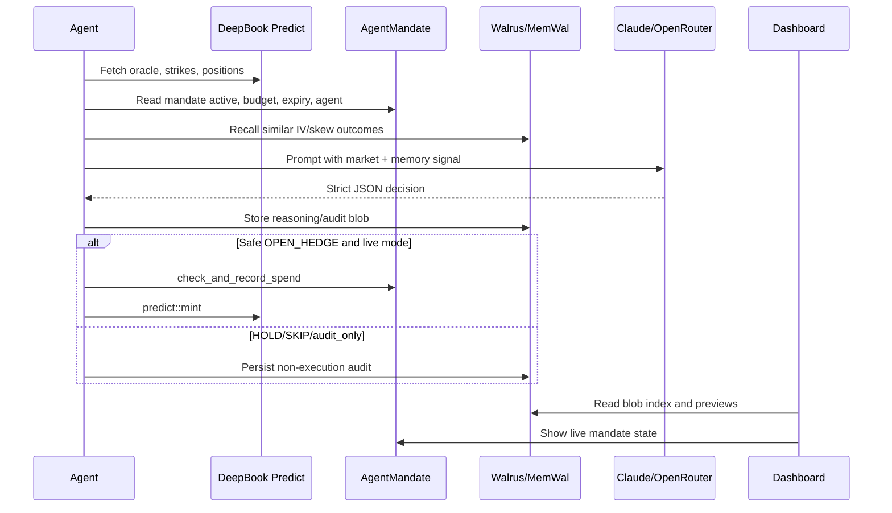

# PredictAI Hedger

PredictAI Hedger is an autonomous hedging agent for the **DeepBook Predict** hackathon track.

DeepBook Predict is the execution engine: the agent reads live Predict oracle data, selects strikes, and can mint or redeem binary hedge positions on Sui testnet. Walrus and MemWal are the verifiable memory layer: every cycle records market context, recalled outcomes, model reasoning, audit metadata, and on-chain effects so judges can inspect why the agent acted.

## Winning Demo

1. Read live DeepBook Predict oracle data, strikes, and positions.
2. Read the real on-chain `AgentMandate` shared object.
3. Reject unsafe cycles when the mandate is inactive, expired, unauthorized, or under budget.
4. Recall similar past outcomes from MemWal and compute a visible memory signal.
5. Ask Claude through Anthropic or OpenRouter for strict JSON: `OPEN_HEDGE`, `HOLD`, or `SKIP`.
6. Store reasoning and audit records through Walrus/MemWal.
7. Execute DeepBook Predict only when all constraints pass.
8. Show mandate state, memory influence, audit blobs, positions, and emergency stop in the dashboard.

## Architecture





## Current Testnet Deployment

| Item | Address |
| --- | --- |
| Latest Mandate Package | `0xff51aded9daed8c664e353361757527f7116690ffa1a0935a0e82cc8ff4c8939` |
| Original Mandate Package | `0x397cc6cc41321679626ab404a054a61ddf96ffdb011d01f3c899c418648708cd` |
| UpgradeCap | `0x186a27060b739e2f0daf6f5f03f3b05bb279db0e839c93b50be29a2595e30a46` |
| Fresh AgentMandate | `0x7af3400943d8e1ace23556b9c2d0a0bdc73c9bf57f7da0b0d997ea3fe01e2588` |
| Fresh KillCap | `0x01697cd6841bf6d3779762b486be0d3c79f59033153aa1ad4fdad58ce3254a52` |
| Mandate Owner | `0x5d16fce4821bba1fda9f30cf015054a1753b61a096ce2a94f9662aa772be7593` |
| Authorized Agent | `0xe4436372db77af0b69d61be90e847f24aeb775bf776e4d1ca5778abf732062da` |
| Predict Package | `0xf5ea2b3749c65d6e56507cc35388719aadb28f9cab873696a2f8687f5c785138` |
| Predict Object | `0xc8736204d12f0a7277c86388a68bf8a194b0a14c5538ad13f22cbd8e2a38028a` |
| PredictManager | `0x18273bb6e954412e33a5250afe8f3b72124856d682962716858714526b608d12` |

Note: Sui upgrades anchor object and event types to the original package ID. Calls use the latest package ID; object type queries and event types may show the original package ID.

## Security Fix

The mandate contract now rejects a mismatched kill capability:

```move
assert!(kill_cap.mandate_id == object::id_address(mandate), E_WRONG_CAP);
```

This prevents a `KillCap` from one mandate being used to stop a different mandate.

## Configuration

Copy and fill ignored env files:

```bash
cp agent/.env.example agent/.env
cp frontend/.env.example frontend/.env.local
```

Recommended demo mode:

```env
EXECUTION_MODE=audit_only
OPENROUTER_MODEL=anthropic/claude-3.5-sonnet
NEXT_PUBLIC_PACKAGE_ID=0xff51aded9daed8c664e353361757527f7116690ffa1a0935a0e82cc8ff4c8939
NEXT_PUBLIC_MANDATE_OBJECT_ID=0x7af3400943d8e1ace23556b9c2d0a0bdc73c9bf57f7da0b0d997ea3fe01e2588
NEXT_PUBLIC_KILL_CAP_OBJECT_ID=0x01697cd6841bf6d3779762b486be0d3c79f59033153aa1ad4fdad58ce3254a52
```

Use `EXECUTION_MODE=live` only after confirming the agent wallet has gas, dUSDC, the correct PredictManager, and safe market conditions.

## Local Commands

```bash
cd contracts
sui move build
sui move test
```

```bash
cd agent
npx tsc --noEmit
npm run start
```

```bash
cd frontend
npm run build
npm run dev
```

Open `http://localhost:3000/dashboard`.

## Judge Script

1. Show the DeepBook-first framing on the landing page.
2. Open the dashboard and show live Predict oracle/strike data.
3. Show `AgentMandate` active state, budget, owner, and authorized agent.
4. Start the agent in `audit_only` mode and show the OpenRouter/Claude decision.
5. Open the Walrus audit trail and inspect the JSON blob preview.
6. Show the memory sentence: comparable outcomes, win rate, and confidence adjustment.
7. Verify the Sui testnet mandate creation or upgrade transaction digest.
8. Connect the owner wallet and demonstrate the kill transaction path when ready.

## Verification Checklist

- `sui move build`
- `sui move test`
- `npx tsc --noEmit` in `agent`
- `npm run build` in `frontend`
- Testnet package upgraded to latest code
- Live mandate created for the local agent signer
- Dashboard reads real mandate and Predict data
- Audit-only agent cycle writes inspectable reasoning

## Why This Fits The Track

PredictAI is not just a dashboard around an LLM. It is a constrained autonomous execution loop: DeepBook Predict supplies the market and execution primitive, the Move mandate enforces user-defined risk limits, and Walrus/MemWal make every decision portable, persistent, and auditable.
